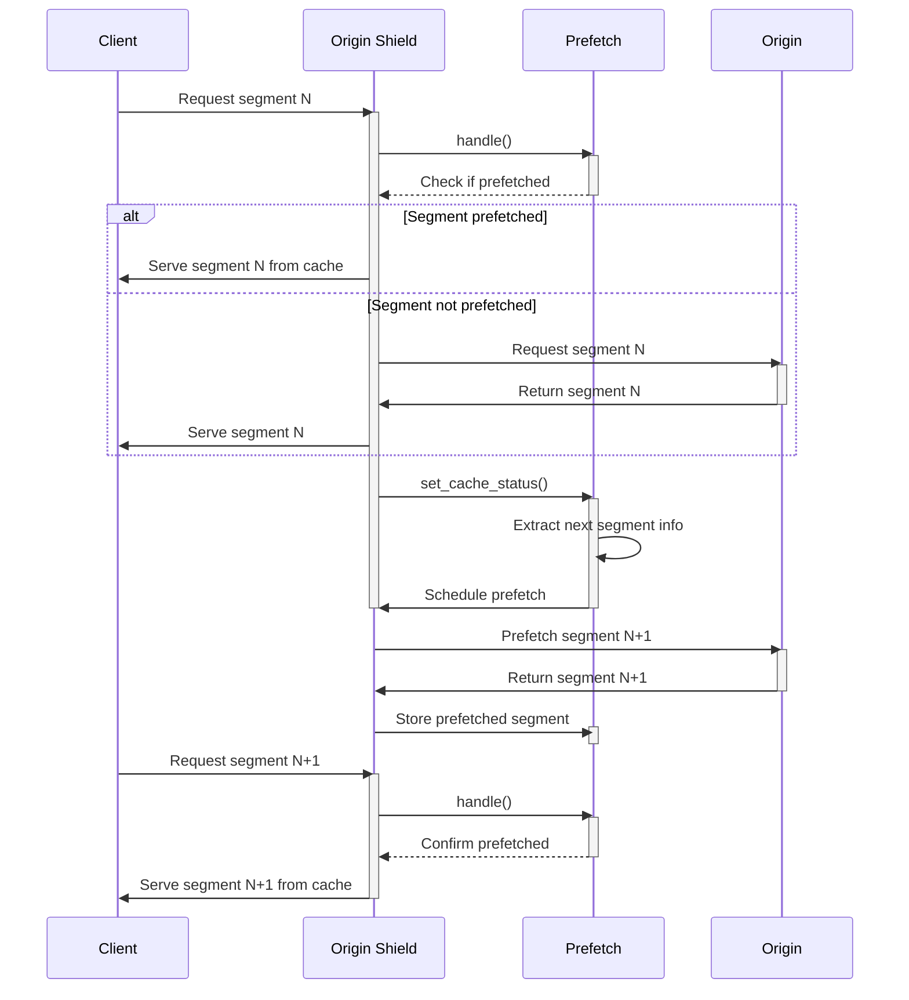

# Prefetch Caching

This is a proof of concept for a pretech caching system designed to download TS (Transport Stream) files by folliwng the `Link` header in the HTTP response for the current segment being downloaded.

## How to run

Starting the NGINX and the origin server is easy as:
```bash
make run
```

If you want to stop the services:
```bash
make stop
```

## How it works

When a request for a segment comes, this modules tries to prefetch the next segment by following the `Link` header in the HTTP response. If the next segment is successfully prefetched, it is stored in the cache and served when requested - so it will be a HIT, not a MISS.

The prefetching is done asynchronously, so the client does not have to wait for the next segment to be downloaded. It reduces the round-trip made by clients to to every server in the cache layer.

A simple workflow:

- Check if each requested segment was prefetched;
- After serving a segment, it looks for information about the next segment (`Link` header);
- If a next segment is identified, it starts an asynchronous prefetch of that segment;
- When the next segment is actually requested, serving it from the cache if it was successfully prefetched.


